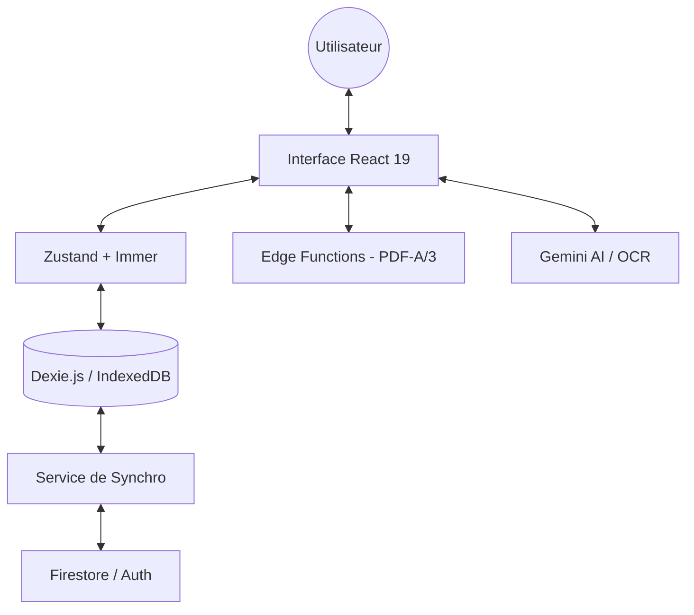
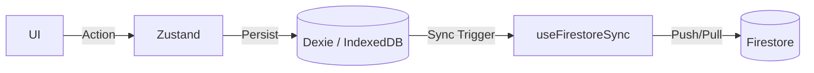

# 🏗️ Architecture Micro-Gestion-Facile

**Vision:** Souveraineté numérique pour micro-entrepreneurs français. Architecture **Offline-First** avec synchronisation Cloud en temps réel.

---

## 📐 Vue d'ensemble



---

## 🔧 Piles technologiques

### **Frontend & Core**

| Technologie      | Rôle                                   | Version |
| ---------------- | -------------------------------------- | ------- |
| **React**        | UI Framework (Concurrent rendering)    | 19      |
| **TypeScript**   | Type Safety & DX                       | 6.0     |
| **Vite**         | Build Tool & Dev Server (Rolldown)     | 8       |
| **Tailwind CSS** | Styling Engine                         | 4       |
| **Zustand**      | State Management (Réactif)             | 5       |
| **Dexie.js**     | Base locale (Offline-First, IndexedDB) | 4+      |
| **Decimal.js**   | Précision financière (Calculs HT/TTC)  | 10      |

### **Backend & Cloud**

| Technologie        | Rôle                                      |
| ------------------ | ----------------------------------------- |
| **Firebase Auth**  | Authentification sécurisée (Google OAuth) |
| **Firestore**      | Synchronisation & backup des documents    |
| **Edge Functions** | Génération PDF-A/3 & Factur-X (Node.js)   |
| **Vercel/Hosting** | Hébergement PWA Native (Service Worker)   |

---

## 📦 État et Persistance

### **Architecture Offline-First**

L'application privilégie la disponibilité locale immédiate.

1. **Zustand (Immer)** : Gère l'état global réactif pour l'affichage immédiat.
2. **Dexie.js (IndexedDB)** : Stocke 100% des données métier localement (`invoiceDB.ts`). Garantie un fonctionnement fluide en mode nomade (train, avion, zones blanches).
3. **Firestore Sync** : Synchronise les changements locaux dès que la connexion est rétablie via `useFirestoreSync.ts`.

### **Calculs Métier**

- **Fiscal** : Lib `lib/fiscalCalculations.ts` pour les seuils TVA/URSSAF 2026.
- **Invoicing** : Lib `lib/invoiceCalculations.ts` avec `Decimal.js` pour éviter les erreurs d'arrondi binaire.

---

## 📊 Modèles de données

### **Structure Locale (Dexie) & Cloud (Firestore)**

```
firestore/
├── invoices/{docId}
│   ├── uid: string (index utilisateur)
│   ├── number: string
│   ├── clientId: string (reference)
│   ├── items: InvoiceItem[]
│   ├── totalHT: number
│   ├── totalTTC: number
│   ├── status: 'draft' | 'sent' | 'paid' | 'overdue'
│   └── ...
│
├── clients/{docId}
│   ├── uid: string
│   ├── name: string
│   ├── email: string
│   ├── phone: string
│   ├── address: string
│   └── ...
│
├── profiles/{uid}
│   ├── companyName: string
│   ├── siret: string
│   ├── defaultVatRate: number
│   ├── invoicePrefix: 'FAC-'
│   └── ... (config utilisateur)
│
└── ... (suppliers, products, expenses, emails, calendar)
```

**Stratégie d'indexation:**

- Index primaire: `uid` (isolation utilisateur)
- Index composite: `uid + status` (requêtes filtrées)
- Index timestamp: `createdAt` (tri)

---

## 🔐 Sécurité

### **Firestore Rules (RBAC)**

```typescript
// Only authenticated users can read/write their own documents
match /collection/{document=**} {
  allow read, write: if request.auth.uid == resource.data.uid
}
```

### **Authentification**

- Google OAuth via Firebase Auth
- Tokens JWT (Firebase)
- Stockage sécurisé (localStorage avec HTTPS)

### **Données sensibles**

- SIRET: visible utilisateur uniquement
- Revenus: isolés par UID
- Email: encrypted at transit (HTTPS)

---

## 🌐 Flux de données

### **1. Authentification**

```mermaid
User → Google → Firebase Auth → User object + JWT → Zustand store
```

### **2. Synchronisation Cloud (Hybrid Offline-First)**

L'application utilise une stratégie de synchronisation bidirectionnelle :

1.  **Ecriture Locale (Immédiate)** : Toute modification est d'abord persistée dans **Dexie.js** (IndexedDB).
2.  **Synchronisation Cloud** : Le hook `useFirestoreSync.ts` observe les changements IndexedDB et les répercute sur **Firestore** avec gestion des conflits (Last Write Wins).
3.  **Lecture Optimiste** : Zustand reflète instantanément l'état local pour une UI réactive à < 16ms.



### **3. Export & Factur-X**

```
Zustand store → JSON/CSV converter → Download file
              → Chiffrement (optionnel) → File stockage local
```

---

## 📱 Composants principaux

### **Pages (entrypoint)**

- `App.tsx` - router logique, auth guard
- `components/Dashboard.tsx` - overview + widgets
- `components/InvoiceManager.tsx` - CRUD factures
- `components/ClientManager.tsx` - CRUD clients
- `components/AccountingManager.tsx` - calculs fiscaux
- `components/SettingsManager.tsx` - profil utilisateur

### **Patterns**

**Pattern 1: Zustand Hook**

```typescript
const state = useAppStore((s) => s.invoices);
const setter = useAppStore((s) => s.setInvoices);
```

**Pattern 2: Firestore Sync**

```typescript
useEffect(() => {
  if (!user) return;
  const unsubscribe = onSnapshot(
    query(collection(db, "invoices"), where("uid", "==", user.uid)),
    (snapshot) => setInvoices(snapshot.docs.map((doc) => doc.data())),
  );
  return unsubscribe; // cleanup
}, [user]);
```

**Pattern 3: Save to Firestore**

```typescript
const saveDoc = async (collection, data) => {
  await setDoc(doc(db, collection, data.id), { ...data, uid: user.uid });
};
```

---

## 🔄 Diagramme de cycle de vie

### **Invoice lifecycle**

```
1. CREATION
   Form input → Zustand → saveDoc() → Firestore

2. EDITION
   Edit modal → Zustand update → saveDoc() → onSnapshot refresh

3. PUBLICATION
   Mark as 'sent' → Email template render → Send via API

4. PAIEMENT
   Mark as 'paid' → Accounting totals update → Reports refresh

5. ARCHIVAGE / EXPORT
   Select → JSON/PDF export → Local download
```

---

## 🛠️ Scripts & Développement

### **Commands**

```bash
npm run dev          # Vite dev server + HMR
npm run build        # Production bundle
npm run lint         # TypeScript check
npm run format       # Prettier auto-format
npm run test         # Vitest unit tests
npm run test:ui      # Vitest debug UI
npm run test:coverage # Coverage report
```

### **Environnement local**

```typescript
// .env.local (create manually)
VITE_FIREBASE_API_KEY = xxx;
VITE_FIREBASE_AUTH_DOMAIN = xxx;
VITE_FIREBASE_PROJECT_ID = xxx;
VITE_FIREBASE_STORAGE_BUCKET = xxx;
VITE_FIREBASE_MESSAGING_SENDER_ID = xxx;
VITE_FIREBASE_APP_ID = xxx;
VITE_GOOGLE_AI_KEY = xxx;
```

---

## 📦 Dépendances critiques

### **À tester / Remplacer (optionnel)**

| Package      | Raison      | Alternative                 |
| ------------ | ----------- | --------------------------- |
| firebase     | Auth + DB   | Supabase (self-hosted)      |
| google/genai | Suggestions | Ollama (local) / Claude API |
| recharts     | Graphiques  | Chart.js / D3.js            |

### **Production-ready**

- ✅ Zustand (state)
- ✅ Decimal.js (calculs précis)
- ✅ Tailwind (CSS)
- ✅ Lucide (icons)
- ✅ date-fns (dates)

---

## 🚀 Roadmap d'amélioration

### **Q2 2026 : Consolidation Fondations**

- [x] Architecture **Offline-First** (Dexie.js + Firestore Sync)
- [x] Migration **React 19** & **Vite 8** (Rolldown)
- [x] UI Engine **Tailwind CSS 4**
- [ ] Abstraction DataLayer (support Supabase optionnel)
- [ ] Validation complète des calculs fiscaux 2026

### **Q3 2026 : Conformité & Mobilité**

- [ ] Génération native **Factur-X** (PDF-A/3) via Edge Functions
- [ ] Signature numérique des factures (Loi anti-fraude)
- [ ] Export JSON/CSV complet pour RGPD
- [ ] Sync multi-device optimisée (Delta sync)

### **Q4 2026 : Intégrations Avancées**

- [ ] OCR automatique des justificatifs d'achat (Gemini AI)
- [ ] Intégration bancaire (Open Banking / Bridge)
- [ ] Dashboard collaboratif (Expert-Comptable / Associés)
- [ ] API REST publique sécurisée

---

## 📚 Documentation additionnelle

- [CONTRIBUTING.md](docs/CONTRIBUTING.md) - Guide contribution
- [DATA_PORTABILITY.md](docs/DATA_PORTABILITY.md) - Portabilité données
- [DEPLOYMENT.md](docs/DEPLOYMENT.md) - Déploiement infrastructure
- [SECURITY.md](SECURITY.md) - Audit sécurité

---

## 💡 Principes de conception

### **1. Souveraineté d'abord**

- Zero données sur serveurs US
- Datacenter France possible
- Export/Backup local facilité

### **2. Open Source**

- MIT/AGPL license
- Contributions bienvenues
- Pas de fork propriétaire

### **3. User-first data**

- Droit à l'oubli implémenté
- Export facile
- Pas de tracking analytics

### **4. Standard first**

- Factur-X (export PDF)
- JSON Schema validation
- SQL migrations versionnées

---

**Dernière mise à jour:** 19 mars 2026  
**Mainteneur:** @Thomasxxl02  
**Communauté:** Contribution bienvenue ! 🤝
